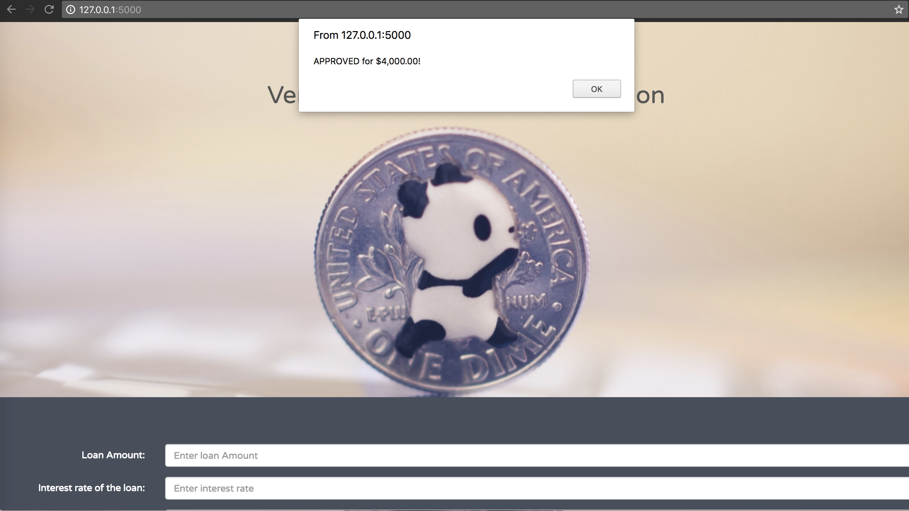

# Lender Bender

Lender Bender

 

Lending Club is a company that helps borrowers and investors access credit. This project will use public data from LendingClub.com topredict the probability of a borrower paying back a loan in full to determinewhether they qualify for a loan. We will use machine learning to determine theprobability and find correlations of given parameters.

Tools:

Ski-learn, Flask, MongoDB, Pandas, Bootstrap, Tableau

 

 

CSV File Meta Data:

**credit.policy** - 1 if customer meet the creditunderwriting criteria, 0 if otherwise

**purpose** -  purpose of the loan i.e., credit card, debtconsolidation, educational, major purchase, small business, and all other           

**int.rate** - interest rate of the loan (a rate of 2% will be entered as 0.02).Riskier borrowers are assigned a  higherrate

**installment**  -borrower’s monthly installment for loan

**log.annual.inc** - borrower’s logarithm of income

**dti** - borrower’s debt to income ratio (amountof debt divided by annual income)

**fico** - borrower’s FICO score

**days.with.cr.line**  - numberof days borrower had a credit line

**revol.bal** - borrower’s revolving balance (unpaidamount at end of credit card billing cycle)

**revol.util** - borrower’s revolving line utilization(amount of credit line used relative to total credit available)

**inq.last.6mths** - inquiries of borrower in the last 6months

**delinq.2yrs** – number of times the borrower was 30+days past due on payment in the last 2 years

**pub.rec** -  borrower’s number of  “bad” records (bankruptcy, tax liens orjudgments) 

**not.fully.paid**  - 1 if borrower did not fully paid, 0 if otherwise

